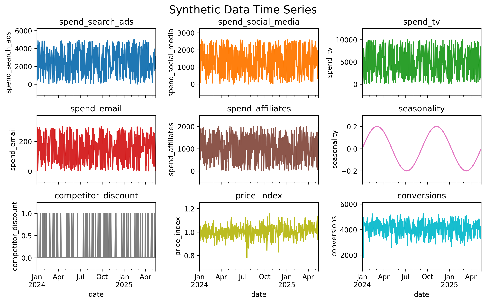
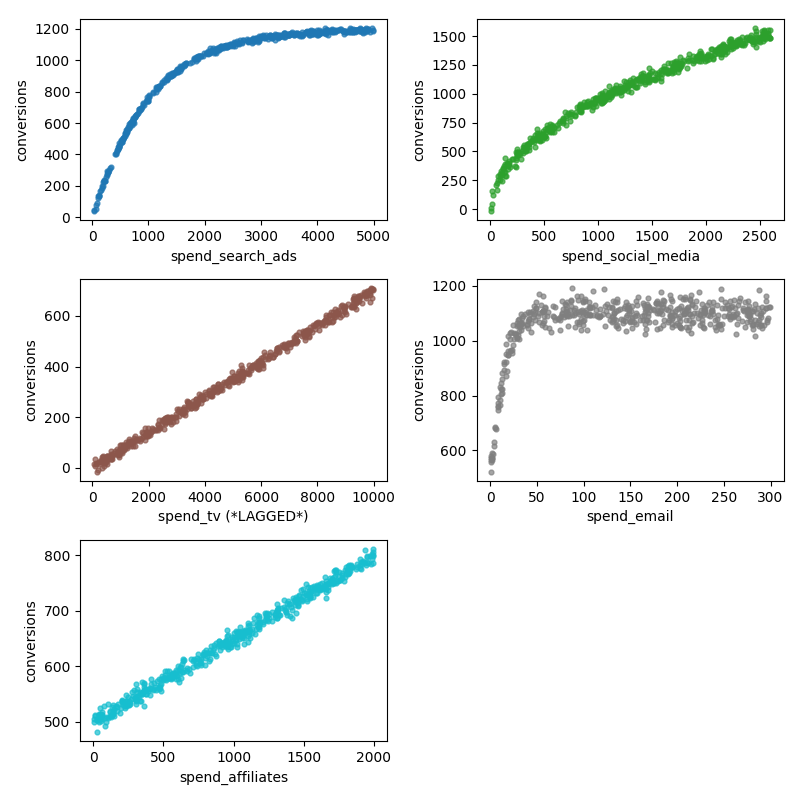
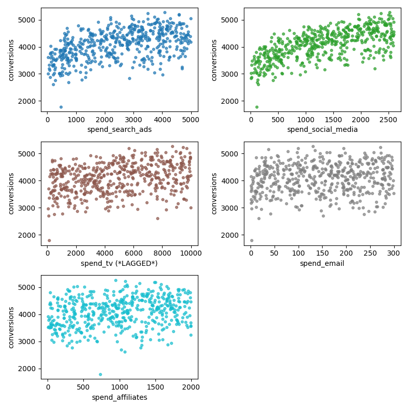
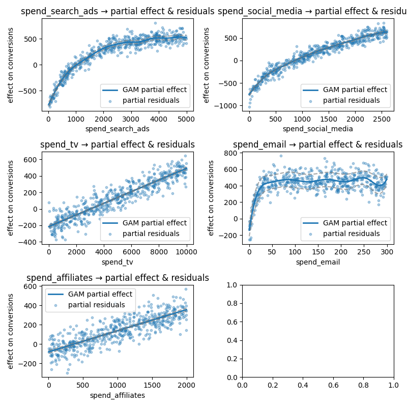
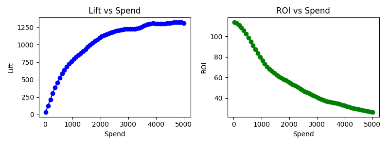

# Marketing Mix Modeling (MMM) with GAMs

---

# 🎯 **Problem Statement**

The goal of this project is to build a concise and practical pipeline for modeling marketing channel data using **Generalized Additive Models (GAMs)** to understand the impact of various marketing channels on conversions.

The challenges tackled here are common in real MMM problems:

1. **Confounders:** competitor activity, price changes, seasonal patterns
2. **Lagged effects:** e.g., TV ads influencing conversions the next day
3. **Saturating effects:**  diminishing returns as spend increases
4. **Noise:** obscures true relationships

---

# 🏗 **Synthetic Data Preparation**

`data_generator.py` — defines the `DataGenerator` class + configs

`run_data_generator.py` — generates the dataset

---

In production, data would come from historical logs. Here, I generated synthetic data to **control the ground-truth functional forms, SNR, lags, and interactions**.

Synthetic data generation = **unit tests for data science**:

- ✅ Simulate edge cases to break-test your pipeline
- 🔍 See if your method recovers hidden effects
- ⚡ Iterate quickly without access bottlenecks
- Available functional forms include **linear** (constant marginal returns) and various **saturating curves** such as `log1p`, `sqrt`, `power`, `sigmoid`, `exponential saturation`, and `hill`, each capturing different shapes of diminishing returns.

---

## 📦 **Variables**

### 💰 **1. Marketing Spend Channels**

Each channel has a distinct (non-linear) relationship with conversions:

- **`spend_search_ads`** — *Exponential saturation*: rapid early gains that quickly flatten as spend increases.
- **`spend_social_media`** — *Square root*: steady gains that grow quickly at first, but with gently diminishing returns.
- **`spend_tv`** — *Near-linear*: almost proportional gains per dollar spent, but effects appear with a **1-day lag**.
- **`spend_email`** — *Sigmoid*: slow impact at low spend, then a rapid rise, eventually plateauing at high spend.
- **`spend_affiliates`** — *Weak linear* effect on its own, but gains accelerate when paired with high search ad spend (**interaction effect**).

---

### ⚙ **2. Confounders**

These variables aren’t marketing spends, but they still affect conversions and must be accounted for to avoid bias.

- **`seasonality`** — *Periodic demand shifts*. Modeled as a sine wave with configurable amplitude and cycles, it captures predictable ups and downs in baseline demand (e.g., holidays, weather patterns)
- **`competitor_discount`** — *Binary event penalty*. Randomly triggered events where a competitor runs a promotion, modeled as a Bernoulli process. Each event day subtracts from conversions by a fixed scale, simulating lost share to competitors
- **`price_index`** — *Continuous competitiveness signal*. A normally distributed index around 1.0, where values > 1.0 indicate relatively higher prices (hurting conversions) and values < 1.0 indicate more competitive pricing (boosting conversions)

---

### 🎯 **3. Response**

- `conversions` — noisy sum of all effects + Gaussian noise

---

## 📈 **Time Series View**

First-glance visualization of variables over time.



---

## 🔍 **Ground Truth Effects**

True latent contributions per variable (hidden in real life, shown here for validation).



When summed with noise → patterns are nearly invisible.



---

# 🧠 **Modeling**

`mmm_analysis.py`

---

## ⏱ **Lagged Variable Identification**

Some channels act instantly (search ads), others have delayed impact (TV). Discover these in a principled way since it would be unknown which variables have a lagged effect

Process:

1. **Correlation scan** across lags: for each variable, for each lag calculate `corr(variable, response)`
2. **Permutation test** for significance
3. **Benjamini–Hochberg** correction
4. Select significant non-zero-lag effects

```python
           variable  best_lag  corr_best  corr_at_0  p_value_adj
 spend_social_media         0   0.642497   0.642497     0.021978
   spend_search_ads         0   0.479385   0.479385     0.007992
           spend_tv        -1   0.290663  -0.022543     0.013320
   spend_affiliates         0   0.229512   0.229512     0.030370
        spend_email         7   0.137233   0.117521     0.011988
        seasonality         5   0.106081   0.101327     0.123876
competitor_discount         0  -0.105823  -0.105823     0.236763
        price_index        -4  -0.104253   0.009771     0.236763
```

As expected `spend_tv` is both significant after p-value adjustment and has a large `corr_best` vs `corr_at_0` difference. Positive lags (e.g., email +7) are usually spurious unless there’s a clear process explanation.

Transform applied in code before fitting: `synthetic_df["spend_tv"] = synthetic_df["spend_tv"].shift(1).fillna(0.0)`

## ⚖ **Lasso Regression Baseline**

Pros:

- Shrinks irrelevant features to zero
- Quick coefficient view

Cons:

- Misses non-linear effects
- Requires manual lag engineering
- Misrepresents importance if curve-shaped

```python
            Feature  Coefficient
   spend_search_ads   280.313377
 spend_social_media   341.451373
           spend_tv   202.614160
        spend_email    46.647356
   spend_affiliates   136.698254
        seasonality    50.873193
competitor_discount   -54.682103
        price_index    -0.309463
```

---

## 🌀 **LinearGAM Model**

GAMs model **smooth non-linear relationships**:

- Spend → `s()` smooth terms
- Confounders → `l()` (linear) or `f()` (factor)
- `lam` penalty tunes smoothness; grid search avoids overfit

```python
# ... build the term list
gam = LinearGAM(term_list).fit(X.values, y)

# tune
lam = np.logspace(-3, 5, 5)
lams = [lam] * 5 + [[0.0]] * len(control_cols)  # zero penalty for controls
gam.gridsearch(X, y, lam=lams)
```



GAM recovered correct shapes — even for complex saturation — with no pre-specified form.

---

# 💹 **Business Metrics**

PDPs are nice, but we have to bring it back to business metrics



1. Lift
    1. Extra conversions over baseline spend = 0.
    2. **Meaning:** “If I raise spend from 0 → X, how many extra conversions do I get?
2. ROI
    1. Assumed value per conversion of 100
    2. **Definition:** `(Incremental Revenue) / (Spend)`
    3. Shows **profitability threshold** for each channel.
